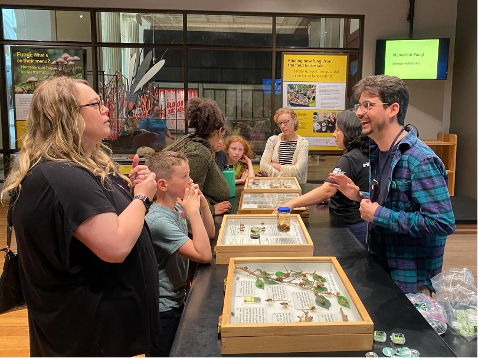
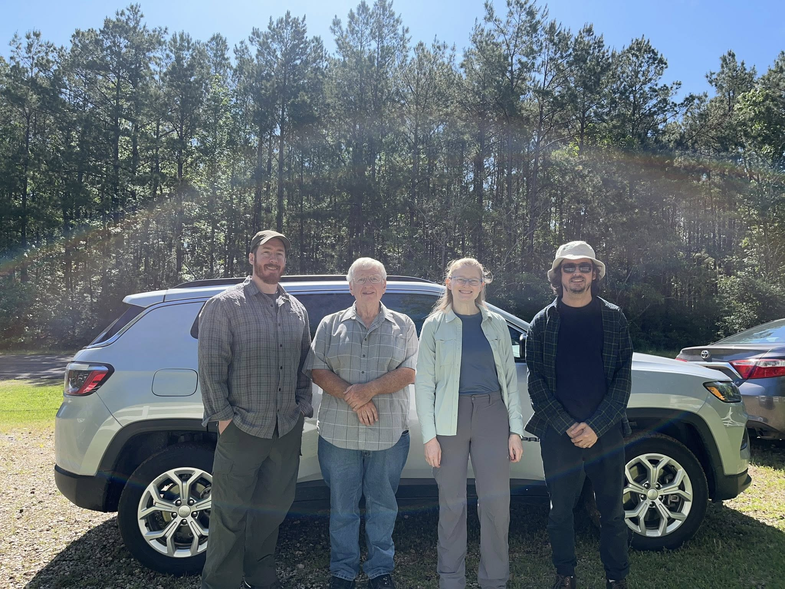
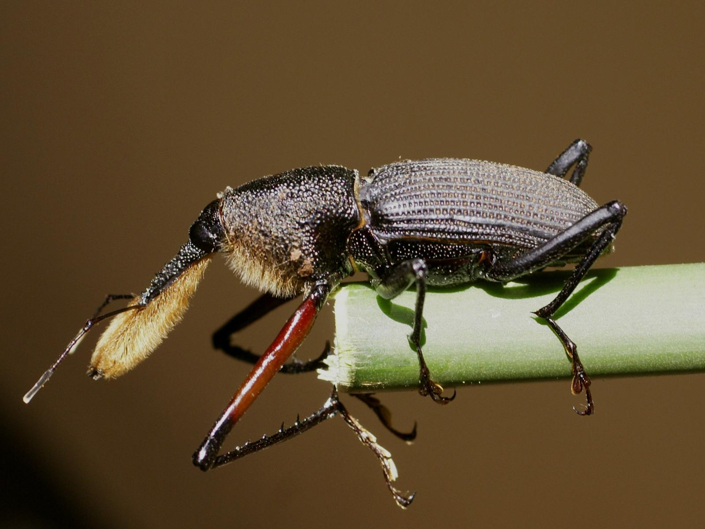

# Diego de S. Souza — personal website

A four-page static website hosted free on GitHub Pages.  
**Live at: https://diego-ds-souza.github.io**

Built with plain HTML, CSS, and vanilla JavaScript — no frameworks, no build tools, no dependencies to install.

---

## Contents

1. [File structure](#file-structure)
2. [Initial deployment (setting up from scratch)](#initial-deployment)
3. [Making changes — general workflow](#making-changes)
4. [Editing text](#editing-text)
5. [Managing images](#managing-images)
   - [Add a new image](#1-add-a-new-image)
   - [Change image order](#2-change-the-order-of-images)
   - [Add or edit a caption](#3-add-or-edit-a-caption)
   - [Replace an existing image](#4-replace-an-existing-image)
6. [Updating publications](#updating-publications)
7. [Updating the CV](#updating-the-cv)
8. [Troubleshooting](#troubleshooting)

---

## File structure

```
/ (repo root)
├── index.html            → Home / About page
├── research.html         → Research projects
├── publications.html     → Publications list
├── outreach.html         → Outreach & Fieldwork galleries
├── styles.css            → All design and layout (colors, fonts, spacing)
├── CV_Diego_de_S_Souza.pdf   → Linked from the "Full CV" button on the home page
└── images/               → All photos used across the site (33 images)
    ├── portrait.jpg
    ├── banner.jpg
    ├── weevil.jpg
    └── … (see image list below)
```

### Complete image list

| Filename | Page | What it shows |
|---|---|---|
| `banner.jpg` | Home | Wide landscape banner at the top of the page |
| `portrait.jpg` | Home | Portrait photo |
| `weevil.jpg` | Research | Bottlebrush weevil (*Rhinostomus barbirostris*) |
| `twig-girdled.jpg` | Research | Twig girdled by *Oncideres impluviata* |
| `girdling.jpg` | Research | Girdling in action (*Oncideres* sp.) |
| `lamiinae-diversity.png` | Research | Composite showing longhorn beetle diversity |
| `repository.png` | Research | Repository Prof. Renato Contin Marinoni banner |
| `neriidae-nipponerius.jpg` | Research | *Nipponerius* fly specimen |
| `neriidae-plate.png` | Research | Plate of Neriidae specimens |
| `outreach-cicadas.jpg` | Outreach | Cicadas table station, Grainger Science Hub, June 2024 |
| `outreach-magicicada.jpg` | Outreach | *Magicicada* close-up, June 2024 |
| `outreach-bioblitz.jpg` | Outreach | Rice Garden Bioblitz, June 2023 |
| `outreach-mnrj-1.jpg` | Outreach | "Conhecendo os besouros" workshop, MNRJ, June 2018 (photo 1) |
| `outreach-mnrj-2.jpg` | Outreach | Same workshop (photo 2) |
| `outreach-mnrj-3.jpg` | Outreach | Same workshop (photo 3) |
| `outreach-paraty-1.jpg` | Outreach | "Conhecendo os besouros" workshop, Paraty, August 2018 |
| `outreach-entimus.jpg` | Outreach | *Entimus imperialis*, Paraty workshop |
| `outreach-club.jpg` | Outreach | "Clube Jovens Cientistas" project, MNRJ |
| `fieldwork-01.jpg` → `fieldwork-14.jpg` | Outreach | Fieldwork photos (numbered in gallery order) |
| `fieldwork-06.png` | Outreach | Fieldwork photo 6 — **PNG format** |
| `fieldwork-15.png` | Outreach | Fieldwork photo 15 — **PNG format** |

---

## Initial deployment

Follow these steps to deploy the site from scratch on a new GitHub account.  
No command line or coding experience required — everything is done through the GitHub website.

### Step 1 — Create a GitHub account

Go to **https://github.com** and click **Sign up**.  
Choose a username carefully — it becomes part of your permanent web address.

### Step 2 — Create the repository

A "repository" is a folder that holds all your website files.

1. Click the **+** button (top-right) → **New repository**
2. **Repository name:** type your username followed by `.github.io`  
   Example: if your username is `diegosouza`, name it `diegosouza.github.io`  
   ⚠️ The name must match your username exactly — this is what makes the site appear at `https://yourusername.github.io`
3. Set visibility to **Public**
4. Leave all other options as-is
5. Click **Create repository**

### Step 3 — Upload the website files

1. On the new repository page, click **Add file → Upload files**
2. Drag in all of the following at once:
   - `index.html`, `research.html`, `publications.html`, `outreach.html`, `styles.css`
   - `CV_Diego_de_S_Souza.pdf`
   - The entire `images/` folder (drag the folder itself — GitHub handles folders)
3. Click **Commit changes**

### Step 4 — Enable GitHub Pages

1. In the repository, click **Settings** (top menu, gear icon — not your profile settings)
2. In the left sidebar, click **Pages** (under "Code and automation")
3. Under **Build and deployment → Source**, choose **Deploy from a branch**
4. Under **Branch**, set the first dropdown to **main** and the second to **/ (root)**
5. Click **Save**

### Step 5 — Visit the live site

Wait **1–2 minutes**, then open **`https://yourusername.github.io`** in your browser.  
If you see a 404 error, wait another minute and refresh — it can take a moment the first time.

A banner will also appear on the Pages settings screen saying "Your site is live at …" once it's ready.

---

## Making changes

All edits follow the same three-step workflow:

1. **Edit the file** on GitHub (pencil ✏️ icon on any file) or upload a new version
2. Click **Commit changes** (green button at the bottom)
3. **Wait ~2 minutes**, then **hard-refresh** the live site:
   - Mac: **Cmd + Shift + R**
   - Windows: **Ctrl + Shift + R**
   - Or open the site in a private / incognito window

If changes don't appear after a hard-refresh, check that the correct file was saved by opening it on GitHub and confirming the new content is there.

---

## Editing text

Click a file in the repo → click the **pencil ✏️ icon** (top-right of the file view) → edit → **Commit changes**.

Text in HTML lives between tags. Edit only the words — never the `< >` tags themselves:

```html
<p>Edit the words here, not the tags around them.</p>
```

Formatting inside text:
- `<em>text</em>` → *italics* (used for species names and journal titles)
- `<strong>text</strong>` → **bold**
- `<a href="URL">link text</a>` → a hyperlink

---

## Managing images

### Rule of thumb

Every image on the site has:
- One **photo file** in the `images/` folder
- One **`` tag** in an HTML file pointing to it

To add, change, or remove an image, you always do both: update the file in `images/` and update the HTML.

---

### 1 · Add a new image

**Step A — Upload the photo to the `images/` folder**

1. In the repo, click **Add file → Upload files**
2. In the path field at the top of the page, type `images/` before the filename to place it in the correct folder
3. Drag your photo file in → **Commit changes**

Name files with lowercase letters, numbers, and hyphens only (no spaces, no special characters).  
Example: `fieldwork-16.jpg`

**Step B — Add the HTML template where you want the photo to appear**

Open the relevant HTML file (pencil icon) and paste the right template.

**Gallery photo — no caption** (fieldwork section):
```html
<figure class="card">
  
</figure>
```

**Gallery photo — with caption** (caption appears on hover and in the lightbox):
```html
<figure class="card captioned">
  
  <figcaption>Your caption text here.</figcaption>
</figure>
```

**Research page — full-width figure with caption below:**
```html
<figure class="fig" style="flex-basis:100%">
  
  <figcaption>Caption text here.</figcaption>
</figure>
```

**Research page — smaller figure beside text (used for portrait-orientation images):**
```html
<figure class="fig">
  
  <figcaption>Caption text here.</figcaption>
</figure>
```

Paste inside the appropriate container in the HTML:
- `<div class="grid">` — for gallery photos (outreach page)
- `<div class="figs">` — for research page figures

---

### 2 · Change the order of images

The order photos appear on screen is the order they appear in the HTML file.

To move a photo, cut its entire `<figure>...</figure>` block and paste it in the new position.  
Select everything from the opening `<figure` to the matching `</figure>`:

```html
<figure class="card captioned">
  
  <figcaption>Caption text here.</figcaption>
</figure>
```

**Example — move the second photo to first place:**
1. Select and cut the second `<figure>...</figure>` block (Cmd+X / Ctrl+X)
2. Click just before the first `<figure>` tag
3. Paste (Cmd+V / Ctrl+V)
4. Commit changes

---

### 3 · Add or edit a caption

**Edit an existing caption:**

Find the `<figcaption>` tag inside the relevant `<figure>` block and change the text:

```html
<!-- before -->
<figcaption>Old caption text.</figcaption>

<!-- after -->
<figcaption>New caption text.</figcaption>
```

**Add a caption to a fieldwork photo that currently has none:**

Fieldwork photos use the no-caption template by default. To add a caption, make two changes:
1. Change `class="card"` to `class="card captioned"`
2. Add a `<figcaption>` line inside the figure

```html
<!-- before (no caption) -->
<figure class="card">
  
</figure>

<!-- after (caption added) -->
<figure class="card captioned">
  
  <figcaption>Collecting insects in the Cerrado, Brazil. 2019.</figcaption>
</figure>
```

The caption will appear when a visitor hovers over the photo, and also in the enlarged lightbox view when they click it.

---

### 4 · Replace an existing image

1. Upload the new photo to the `images/` folder (Step A above)
2. In the HTML, find the `` tag for the old photo and change the filename in `src="..."`:

```html
<!-- before -->


<!-- after -->

```

The old file stays in the `images/` folder — it just won't be used anymore.  
You can delete unused files by clicking the file on GitHub → the trash icon → Commit changes.

---

## Updating publications

Open `publications.html` (pencil icon) and find the correct `<ol class="pubs">` section  
(there are three: Articles, Book chapters, Websites).

Copy an existing entry and edit the text. Each entry follows this pattern:

```html
<li>
  <span class="n">35.</span>
  <span>
    <span class="me">Souza, D.S.</span>, Co-Author, A.B. 2026.
    Title of the paper.
    <em>Journal Name</em> 10(2): 100–110.
    <a class="doi" href="https://doi.org/10.XXXX/XXXXX" target="_blank" rel="noopener">DOI</a>
  </span>
</li>
```

Notes:
- `<span class="n">35.</span>` — the entry number. Update the numbers of all entries below when you add one at the top.
- `<span class="me">Souza, D.S.</span>` — wrapping your name in this makes it **bold**
- `<em>Journal Name</em>` — italicises the journal name
- Replace the `href` value with the actual DOI URL (e.g., `https://doi.org/10.1111/syen.12660`)
- If there is no DOI yet, remove the entire `<a class="doi"...>DOI</a>` line

---

## Updating the CV

Upload the new PDF file to the **root of the repository** (not inside `images/`)  
with the exact same filename: **`CV_Diego_de_S_Souza.pdf`**

GitHub will overwrite the old file automatically. No HTML changes needed.

---

## Troubleshooting

**Changes not showing on the live site**
- Wait 1–2 minutes after committing, then hard-refresh: **Cmd+Shift+R** (Mac) / **Ctrl+Shift+R** (Windows)
- Or open the site in a private/incognito window, which bypasses the cache
- Check on GitHub that the file actually shows your new content (open the file in the repo)

**A photo is not showing (broken image icon)**
- Check that the filename in `src="images/..."` exactly matches the file in the `images/` folder
- Filenames are case-sensitive: `Portrait.jpg` and `portrait.jpg` are different files
- Make sure the file was uploaded to the `images/` folder and not to the repo root

**The site shows a 404 error**
- Make sure GitHub Pages is enabled: Settings → Pages → Branch: main / (root) → Save
- Wait 2–3 minutes after enabling and refresh

---

## Tech stack

| | |
|---|---|
| Languages | HTML, CSS, JavaScript (vanilla — no frameworks) |
| Fonts | Fraunces + Hanken Grotesk via Google Fonts |
| Hosting | GitHub Pages (free) |
| Build tools | None — files are served directly as-is |

---

© 2026 Diego de Santana Souza. All rights reserved.
